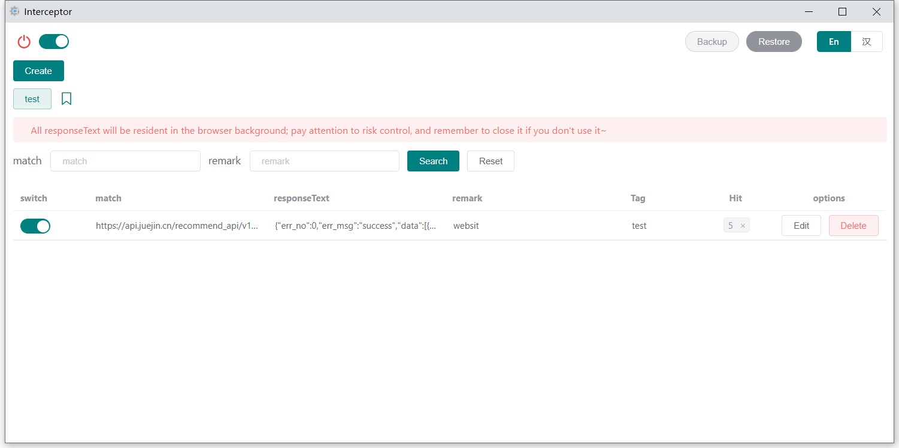
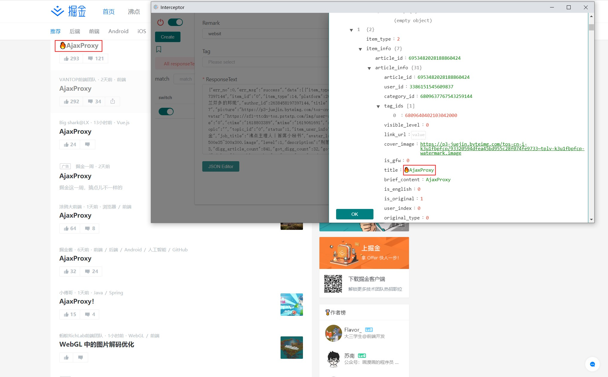

# Ajax proxy

> Chrome plugin 
>
> Chrome extension
>
> Interceptor
>
> Ajax 拦截，修改响应数据 

### 使用示例

### 快捷键

| Commands    |          |
| ----------- | -------- |
| Shift+Alt+Q | 打开面板 |
| Shift+Alt+C | 关闭面板 |
| Shift+Alt+W | 全屏     |
| Shift+Alt+S | 调整尺寸 |

### 更新说明

- v1.6
  - 快捷键操作
- v1.5
  - 命中率上限通知
  - badge
- v1.4
  - 命中率展示
- v1.2
  - JSON编辑器